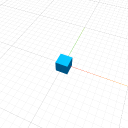

# 3mf export MVP

This is a fork from `3mf-export` to allow it to move forward with a robust XML library.

`3mf-export-comapct`

- is less robust for XML (may break xml if some attribute velues are not sanitised)
- has no dependencies
- could be preferred by some people because of small footprint
- I want to keep it as proud example of using arrays and join to gain nice performance.

 

This is a set of functions to generate 3mf content for exporting 3d models and optionally embedding a thumbnail.

reference: https://github.com/3MFConsortium/spec_core/blob/master/3MF%20Core%20Specification.md

Format is defined by openxmlformats.

3mf file is a zip file that you need to produce using a zip library of your choice.

# object ids > 0

lib3mf cannot recognize things with id 0, so it is recommended to not use zero as id

# contents of said zip file

File names (with path) and metadata are hardcoded as it is not important for the purpose of exporting a model.

File names 
- `[Content_Types].xml` - static file describing content types [src/staticFiles.js]
- `_rels/.rels` -  [src/staticFiles.js]
- `/3D/3dmodel.model` - you must use this exact path to store model data
- `/Metadata/thumbnail.png` - you must use this exact path to store the optional thumbnail

# sample code to generate 3mf

Checkout the code from github and run `npm install` then `node testGen.js`.

Sample code to generate 3mf file is in [testGen.js]. It uses `fflate` which is intentionally set as
devDependency so others can generate the zip file with own preferred library.

To demonstrate that it is simple to include a thumbnail, I am using one already generated by my old jscad prototype
where this 3mf code is from. Final usage will of course be to take a snapshot from canvas while exporting the mesh.
Sample of such code is left in [testGen.js] but unused.
