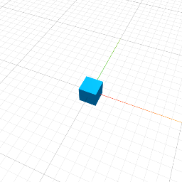

# 3mf export MVP

This is a set of functions to generate 3mf content for exporting 3d models and optionally embeding a thumbnail.

reference: https://github.com/3MFConsortium/spec_core/blob/master/3MF%20Core%20Specification.md

Format is defined by openxmlformats.

3mf file is a zip file that you need to produce using a zip library of your choice.

# contents of said zip file

File names (with path) and metadata are hardcoded as it is not important for the purpose of exporting a model.

File names 
- `[Content_Types].xml` - static file describing content types [src/staticFiles.js]
- `_rels/.rels` -  [src/staticFiles.js]
- `/3D/3dmodel.model` - you must use this exact path to store model data
- `/Metadata/thumbnail.png` - you must use this exact path to store the optional thumbnail

# sample code to generate 3mf

Checkout the code from github and run `npm install` then `node testGen.js`.

Sample code to generate 3mf file is in [testGen.js]. It uses `fflate` which is intentionally set as
devDependency so others can generate the zip file with own preferred library.

To demonstrate that it is simple to include a thumbnail, I am using one already generated by my old jscad prototype
where this 3mf code is from. Final usage will of course be to tak a snapshot from canvas while exporting the mesh.
Sample of such code is left in [testGen.js] but unused.

# array of strings and `Array.join('')`

`Array.join('')`

After multiple explorations and tests it looks like  is the best choice to combine large number of strings. It can calculate size of final string in advance. It is faster or at least very similar to other, and can handle more than 65536 strings.

`String.concat()` 

Also can calculate size of new string in advance. At the time of writing this library it had similar performance in Chrome but was much slower than `Array.join('')`. It has one big drawback because it is limited to 65536 elements due to using varargs input.

` str +=` 

is slowest as it has to copy old data again and again for each step.
