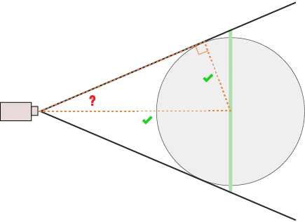

# intro



found this example for threejs that seems ok

```js
// https://github.com/mrdoob/three.js/pull/14526#issuecomment-497254491
function zoomCameraToSelection( camera, controls, selection, fitOffset = 1.2 ) {
  const box = new THREE.Box3();
  
  for( const object of selection ) box.expandByObject( object );
  
  const size = box.getSize( new THREE.Vector3() );
  const center = box.getCenter( new THREE.Vector3() );
  
  const maxSize = Math.max( size.x, size.y, size.z );
  const fitHeightDistance = maxSize / ( 2 * Math.atan( Math.PI * camera.fov / 360 ) );
  const fitWidthDistance = fitHeightDistance / camera.aspect;
  const distance = fitOffset * Math.max( fitHeightDistance, fitWidthDistance );
  
  const direction = controls.target.clone()
    .sub( camera.position )
    .normalize()
    .multiplyScalar( distance );

  controls.maxDistance = distance * 10;
  controls.target.copy( center );
  
  camera.near = distance / 100;
  camera.far = distance * 100;
  camera.updateProjectionMatrix();

  camera.position.copy( controls.target ).sub(direction);
  
  controls.update();
  
}
```

The gist of it looks like this

```js
  // get maximum size
  const maxSize = Math.max( size.x, size.y, size.z );
  // have not
  const fitHeightDistance = maxSize / ( 2 * Math.atan( Math.PI * camera.fov / 360 ) );
  const fitWidthDistance = fitHeightDistance / camera.aspect;
  const distance = fitOffset * Math.max( fitHeightDistance, fitWidthDistance );
```

It does not take into consideration object orientation to camera, just makes sure it will fit in worst case scenario.


## Additional material

https://github.com/yomotsu/camera-controls/blob/99a23397f9c4667b30ce0d54cb2eb09351b65fc9/src/CameraControls.ts#L2344

```js
	getDistanceToFitBox( width: number, height: number, depth: number, cover: boolean = false ): number {
		const boundingRectAspect = width / height;
		const fov = this._camera.getEffectiveFOV() * DEG2RAD;
		const aspect = this._camera.aspect;

		const heightToFit = ( cover ? boundingRectAspect > aspect : boundingRectAspect < aspect ) ? height : width / aspect;
		return heightToFit * 0.5 / Math.tan( fov * 0.5 ) + depth * 0.5;

	}
```

```js
	getDistanceToFitSphere( radius: number ): number {
		// https://stackoverflow.com/a/44849975
		const vFOV = this._camera.getEffectiveFOV() * DEG2RAD;
		const hFOV = Math.atan( Math.tan( vFOV * 0.5 ) * this._camera.aspect ) * 2;
		const fov = 1 < this._camera.aspect ? vFOV : hFOV;
		return radius / ( Math.sin( fov * 0.5 ) );

	}
```
