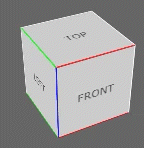
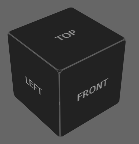
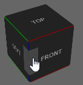
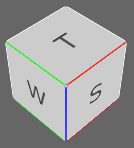

# Cube camera gizmo Web Component

|     | Check the demo at: https://hrgdavor.github.io/jscadui/html-gizmo/    |
| ---- | ---- |


## Install

Add the gizmo dependency to your node project

```shell
npm i --save-dev @jscadui/html-gizmo
```

## Use

You need to import the gizmo and register custom html element so you can decide the html tag name.

```js
import { Gizmo } from '@jscadui/html-gizmo'
Gizmo.define()
```

 After that you can add the gizmo either in html

```js
<div class="myContent">
    <jscadui-gizmo id="myGizmo"/>
</div>
<script>
        const gizmo = document.getElementById('myGizmo')
</script>
```

 or you can add the gizmo in JS

```js
<div class="myContent" id="myContent">
</div>
<script>
        const myContent = document.getElementById('myContent')
        const gizmo = new Gizmo()
        myContent.appendChild(gizmo)
</script>
```

## Styling

The gizmo uses [shadow DOM](https://developer.mozilla.org/en-US/docs/Web/Web_Components/Using_shadow_DOM) to avoid issue with your own CSS leaking into it, but opens some variables that you can use to customize the look.

```css
jscadui-gizmo{
  /** colored axes */
  --cube-z-color: #00f;
  --cube-x-color: #f00;
  --cube-y-color: #0f0;
 /* these are the default values for configurable variables. 
  Keep only those that you change */
  --cube-size: 100px;
  --cube-line-color: #fff;
  --cube-bg: #ccc;
  --cube-fg: #444;
  --cube-bg-hover: #eee9;
  --cube-fg-hover: #444;
  --cube-corner-radius: 5px;
}
```

To limit number of variables some things you can style further via `::part`. In this example change the font style and font family:

```css
jscadui-gizmo::part(face){
  font-size: 18px;
  font-family: Monospace;
}
```

### Styling from JavaScript

If you have theme information in your JavaScript you can easily set any of these variables that way

```js
gizmo.style.setProperty("--cube-line-color", #fff)
```

### Example dark theme



```css
jscadui-gizmo{
  --cube-line-color: #666;
  --cube-bg: #222;
  --cube-fg: #aaa;
  --cube-bg-hover: #4449;
  --cube-fg-hover: #aaa;
}
```

you can also add axes colors, but lower intensity will look better for dark theme:

```css
  --cube-z-color: #00a;
  --cube-x-color: #900;
  --cube-y-color: #090;
```





## Resize the gizmo

You can set the size other than `100px` via css variable `--cube-size` or use the API method `setSize(size)`

```js
gizmo.setSize(150)
```

## Moving the gizmo (in sync with your camera)

To move the gizmo you can use the css variable `--cube-transform` or use the API method `rotateXZ(rx,rz)` . The api method will aside from the rotation also set the default scale of the cube that is `0.8`, so if you call `gizmo.rotateXZ(0.712704, 0.785398)` you will get :

````html
<jscadui-gizmo style="--cube-transform:scale3d(0.8,0.8,0.8) rotateX(0.712704rad) rotateZ(0.785398rad);">
````

If you know look-at position `target` and camera location `position` you can calculate the angles from that

```js
const x = position[0] - target[0]
const y = position[1] - target[1]
const z = position[2] - target[2]
let len = Math.hypot(x, y, z)
let lenXY = Math.hypot(x, y)
let rz = lenXY == 0 ? 0 : acos(x / lenXY)
let rx = lenXY == 0 ? 0 : acos(lenXY / len)
if (z < 0) rx *= -1 // negative side is lost during sqr/sqrt hypot
if (y > 0) rz *= -1 // negative side is lost during sqr/sqrt hypot

gizmo.rotateXZ(rx,rz)
```

##  Change labels

You can provide your own text for the gizmo in the constructor or later on too (font size is not automatic, you need to change it to accomodate your labels ).



```js
const gizmo = new Gizmo({T:'T',B:'B',N:'N',S:'S',E:'E',W:'W'})
// OR 
gizmo.setNames({T:'T',B:'B',N:'N',S:'S',E:'E',W:'W'})
```

## Listen to camera location clicks

```js
gizmo.oncam = e=>console.log('Camera location: ', e.cam)
```

With default translations the `e.cam` values will be:

- `T` - TOP 
- `B` - BOTTOM
- `N` - BACK
- `S` - FRONT
- `W` - LEFT
- `E` - RIGHT

The world compass sides were chosen for short name because if we just take first letter of the translations on the right we have a conflict with BOTTOM and BACK.

For the sides and corners the `e.cam` returns values like: `TS` `TSE` `TE` `SE` `BNW` ...
