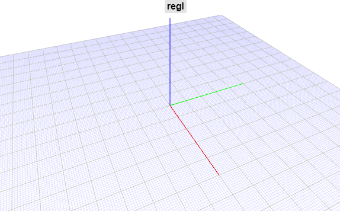
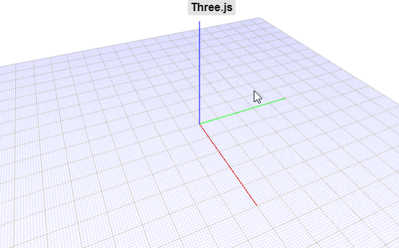
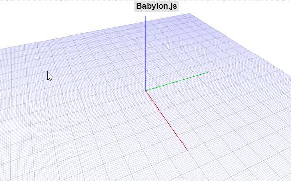

# jscadui scene utility
This is set of standalone 3d models that are useful for presentation. The model produced is in the interchange format defined by `@jscadui/format-common`.

## makeAxes
Creates axes lines for x,y,z

## makeGrid
Creates grid lines

## preview
Here is how it looks in different WEBGL engines.

